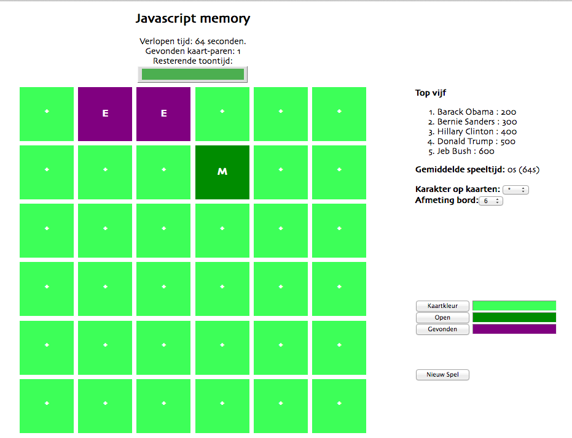

# Toetsing: Memory game

De toetsing van dit kwartaal wordt gedaan aan de hand van het bekende spel memory. Gedurende acht weken werk je samen met een duo-partner aan dit spel, waarbij je op vier verschillende momenten je vorderingen tot dan toe moet inleveren. De eisen die op deze toetsmomenten aan het spel gesteld worden corresponderen met de onderwerken die in de periode hiervóór aan de orde zijn gekomen, zodat je het spel sequentieel kunt opbouwen.

Elke week wordt een klein overzicht gegeven van de eisen waar je memory-spel in die week aan moet voldoen. Hoewel de *beoordeling* van het spel niet elke week plaatvindt, raden we je toch aan om deze planning aan te houden; anders loop je het risico achter te gaan lopen. Inleveren doe je door een zip-bestand van je code op Blackboard te uploaden – zie de deadlines aldaar. Let op: te laat inleveren is een onvoldoende voor dat onderdeel.

Elk onderdeel van het memory-spel wordt met een cijfer beoordeeld. Het eindcijfer voor dit onderdeel is het rekenkundig gemiddelde van deze vier deelcijfers. In het geval van een onvoldoende worden er individuele reparatiewerkzaamheden (inclusief deadline) afgesproken.

