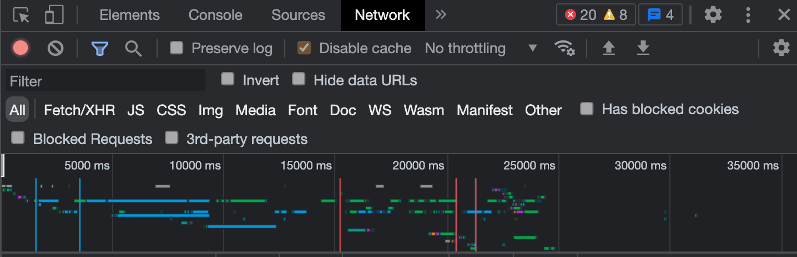

# Week 1: Inleiding

In deze eerste week kijken we naar de algemene architectuur van het web, bespreken we de verhouding tussen de voor- en de achterkant van webapplicaties en analyseren we de werking van de meest gebruikte soort applicatie: de webbrowser.

## Hoorcollege

In het hoorcollege gaan we in op de werking van een webbrowser. Wat gebeurt er allemaal vanaf het moment dat je een url in de navitiebalk intypt en op enter druk tot het moment dat er een fraaie webpagina op het scherm tevoorschijn komt? We bespreken de ontstaansgeschiedenis van internet en van de webbrowser – een geschiedenis waar we heden ten dage nog immer de gevolgen van ondervinden. Er wordt verder ingegaan op de gevolgen die deze ontwikkeling heeft voor de web-ontwikkelaar, hoe om te gaan met verschillende soorten browsers en een diversiteit aan hardware.

Na deze meer theoretische inleiding bekijken we de technieken die de web-ontwikkelaar ten dienste staan om op een goede en effectieve manier te werken. We gaan uitgebreid in op de development-tools en laten aan de hand van uitgebeide voorbeelden zien hoe deze kunnen worden ingezet.

 
## Practicum

Tja, wat doen we bij het practicum in de eerste week...?

Misschien in ieder geval een leesopdracht/docu/discussie over de geschiedenis van browsers / webpagina's gecombineerd met wat opdrachten waarmee de browser geinspecteerd wordt? Dit om alvast te onderzoeken / spelen en een idee te krijgen van de browser en de opbouw van webpagina's. Zie het practicum bestand voor een schets hiervan.

## Literatuur

Misschien die documentaire laten kijken? 
https://mandarin.nl/heralds/

Kunstzinnige en grappige projecten over de architectuur van webpagina's (leuk voor in hoorcollege):
- Live web coding performance, een soort VJ'en in de JavaScript console: https://player.vimeo.com/video/318721981?dnt=true
- Scultpuren van websites: https://jip.debeer.it/facebook-in-gold/ & https://jip.debeer.it/google-in-gold/
- http://motherfuckingwebsite.com/ & http://bettermotherfuckingwebsite.com/ & https://thebestmotherfucking.website/

