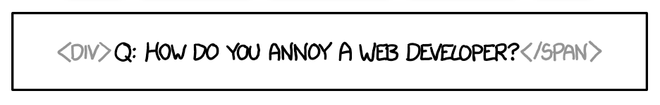

# Week 1: HTML en CSS 1

In deze eerste week kijken we naar de algemene architectuur van het web, bespreken we de verhouding tussen de voor- en de achterkant van webapplicaties en analyseren we de werking van de meest gebruikte soort applicatie: de webbrowser.

## Hoorcollege

In het hoorcollege gaan we in op de werking van een webbrowser. Wat gebeurt er allemaal vanaf het moment dat je een url in de navitiebalk intypt en op enter druk tot het moment dat er een fraaie webpagina op het scherm tevoorschijn komt? We bespreken de ontstaansgeschiedenis van internet en van de webbrowser – een geschiedenis waar we heden ten dage nog immer de gevolgen van ondervinden. Er wordt verder ingegaan op de gevolgen die deze ontwikkeling heeft voor de web-ontwikkelaar, hoe om te gaan met verschillende soorten browsers en een diversiteit aan hardware.

Na deze meer theoretische inleiding bekijken we de technieken die de web-ontwikkelaar ten dienste staan om op een goede en effectieve manier te werken. We gaan uitgebreid in op de development-tools en laten aan de hand van uitgebeide voorbeelden zien hoe deze kunnen worden ingezet.

Vervolgens gaan we in op HTML en CSS. We bouwen verder op webtechnologie 1 (dat in de propdeuse gegeven wordt) en op de eerste week van webtechnologie 2 (periode 2.3). We gaan hier in op de exacte werking van deze technieken, bespreken de meer semantische elementen en kijken hoe je kunt ontwerpen voor toegankelijkheid. 

 
## Practicum

Aan de hand van specifieke en concrete opdrachten zullen tijdens het practicum verschillende voorbeelden uitgewerkt worden, waarbij geëxperimenteerd wordt met complexe *matching rules*, *reflection* en *global attributes*. We zullen aan de hand van een eenvoudige zelfgemaakte browser de *flow layout* demonstreren.

We kijken ook naar meer creatieve websites, zoals 

- Live web coding performance, een soort VJ'en in de JavaScript console: https://player.vimeo.com/video/318721981?dnt=true
- Scultpuren van websites: https://jip.debeer.it/facebook-in-gold/ en https://jip.debeer.it/google-in-gold/
- http://motherfuckingwebsite.com/ en http://bettermotherfuckingwebsite.com/ en https://thebestmotherfucking.website/
- https://theuselessweb.com/
- https://pointerpointer.com/

## Literatuur

Bekijk de documentaire [The Heralds of Resource Sharing](https://mandarin.nl/heralds/) en beantwoord de onderstaande vragen:

1. Netwerken zoals internet maken gebruik van een zogenaamde 'store and forward technique'. Welk probleem wordt hiermee opgelost? 

2. In de documentaire wordt vrij uitgebreid gesproken over 'Interface Message Processors' of 'IMP's. Waarmee zijn die IMP's te vergelijken in meer hedendaagse technieken?

3. In de tijd van deze documentaire waren computer heel groot en heel duur, dus het was niet handig (of mogelijk) om er veel van te hebben. Licklider heeft het over 'time sharing' als oplossing voor dit probleem. Op welke manier vormt 'time sharing' hier een oplossing voor?

4. De documentaire eindigt met een opmerking van Licklider: 

"The processing and distribution technology and the storage technology are gonna make it possible to get over onto a new technological base for intellectual efforts before our ponderous social processes will let us. And I think more people ought to get in there and think about the social proces. "

Denk je dat deze sociale processen inmiddels beter zijn doordacht? Leg uit.

