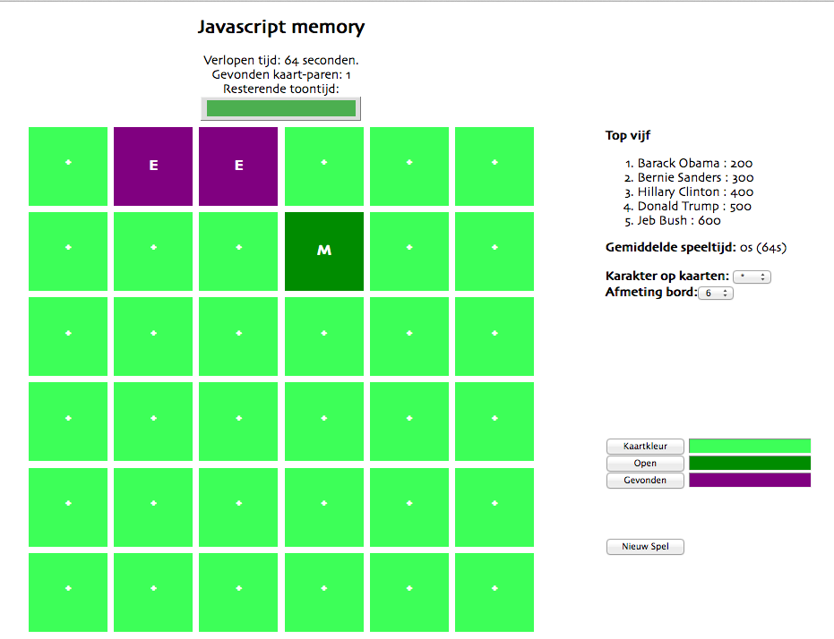

# Memory week 2

In deze opgave maken we het bekende spel 'Memory' na, eerst alleen nog in HTML en CSS. Dit spel breiden we elke week uit met meer functionaliteit. Deze week zetten we de layout op en voegen we eventueel al wat minimale styling toe aan het memory spel.

Maak een leeg HTML bestand aan, en creëer een HTML "skelet" (een soort "hello world" bestand). Zorg in ieder geval dat er een document type gedeclareerd wordt, en dat de html- en bodytags er op een juiste manier in staan. HTML Basic (w3schools.com)

Bestudeer onderstaande afbeelding van het memory spel en zorg er met HTML elementen voor dat het dezelfde inhoud heeft als wat je op de afbeelding ziet: titels, teksten, knopjes, en een speelveld van 6 bij 6.

De speelvlakken hebben vooralsnog twee statussen: 'open' en 'gesloten'. Nu volstaat het om deze twee "hard coded" aan verschillende divs mee te geven – in de loop van de komende periode zullen we hier werkelijk functionaliteit aan toevoegen.

