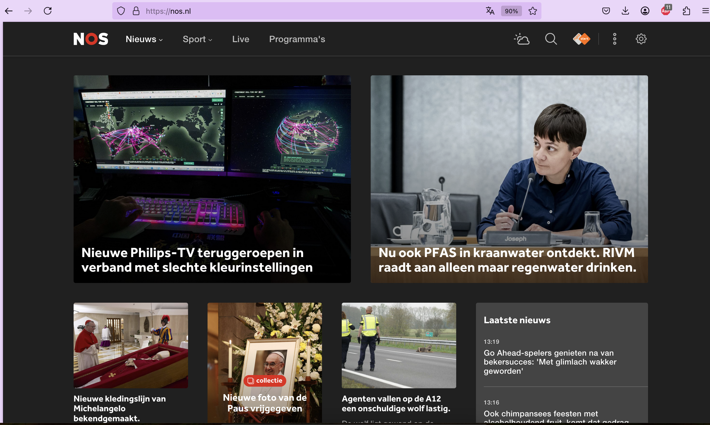

# Week 1 - Browser, HTML & CSS

In dit practicum maak je kennis met algemene frontend technieken, waaronder componenten van de webbrowser en webpagina's, html elementen, developer tools, netwerk, console, JavaScript, styling, etc. 

**1e helft**: Browser & webpagina's
- Inspect element
- Styles
- Network
- Console
- Performance

**2e helft**: HTML & CSS
- CV bouwen

---

## Browser & webpagina's

#### [ 1/4 ] Inspect element (10 minuten)

Open de browser en navigeer naar [hanze.nl](https://www.hanze.nl). Klik met de rechtermuistoets ergens willekeurig op de pagina en selecteer “inspect” of “inspect element”.

1. Wat voor soort HTML elementen/tags worden gebruikt voor het opsommen van de lijst *opleidingen*, *open dagen & voorlichtingen*, en *bedrijven*? 

1. Vind voorbeelden van:
    - `<a>`
    - `<p>`
    - `<h1>`
    - `<input>`
    - `<li>`
    - `<span>`

---

#### [ 2/4 ] Inspect element (10 minuten)

Verander de nieuwskoppen van je favoriete nieuwssite naar wat luchtiger/positiever nieuws, en mail deze naar de docent.



---

#### [ 3/4 ] Inspect element (10 minuten)

Ga naar het Twitter account van de Amerikaanse president Joe Biden. Als je een twitter account hebt, zorg dan dat je **uitgelogd** bent.

1. Scroll naar beneden en je zult gevraagd worden om in te loggen of te registeren. Doe dit niet. Zorg in plaats daarvan dat je de "muur" verwijdert, het het scrollen weer activeert. **Hint**: zoek naar het element waarbij in CSS de `pointer-events` zijn uitgeschakeld (tabje Styles). Als je die gevonden hebt, schakel de pointer events weer in.

1. Pas vervolgens een willekeurige tweet aan door een tekst naar keuze, en mail deze naar de docent.


---

#### [ 4/4 ] Inspect element - nabespreking (10 minuten)
Wat vind je ervan dat je zomaar nieuwssites en Twitter posts kunt aanpassen?


---

#### Styles (15 minuten)

Open de browser en navigeer naar [hanze.nl](https://www.hanze.nl). Klik met de rechtermuistoets ergens willekeurig op de pagina en selecteer “inspect” of “inspect element”. Open in het tabje Elements het tabje Styles.

1. Selecteer een element dat de typische Hanze-oranje kleur bevat. Wat is de kleurcode?
1. Maak het Hanze logo twee keer zo groot.
1. Verwijder de achtergrond foto.
1. De Hanze website wordt natuurlijk veel mooier in een developer-achtige look. Geef alle tekst het lettertype `monospace`.
1. Vervang de teksten bovenaan de pagina (welkomsttekst, menu-items, etc.) door teksten naar keuze.
1. Vervang de achtergrondkleuren door een kleur naar keuze.
1. Vervang het Hanze logo door een logo van een ander bedrijf naar keuze (link).
1. Mail je creatie naar de docent.


---

#### Network (10 minuten)

1. Open het tabje Network/Netwerk en ververs [hanze.nl](https://www.hanze.nl). Wat is de url van de achtergrondfoto bovenaan de pagina?

1. We gaan testen hoe snel de website laadt op een snel 3G netwerk.
  	- Zorg dat de opname knop aan staat
    - Vink "disable cache" aan. 
    - Zet network throttling op "Fast 3G".
    - Wat is de totale laadtijd van de pagina?
    - Welk bestand is het grootst en neemt het meeste laadtijd in beslag?


---

#### Console (15 minuten)

Navigeer naar [google.com](https://google.com/). Verwijder alle elementen behalve de zoekbalk en het microfoon icoontje.

Selecteer het google logo (`img` element) en typ naast ``class=".."`` het volgende: 

```
id="google-logo"
```

Open de tab 'console' en voer de volgende JavaScript code uit:

```javascript
document.getElementById("google-logo").animate([
  // keyframes
  { transform: 'rotate(0deg)' },
  { transform: 'rotate(360deg)' }
], {
  // timing options
  duration: 1000,
  iterations: Infinity
});
```

Wat gebeurt er met het logo?

Voer bovenstaande code nogmaals uit, maar vervang dit keer de woorden ``rotate`` door ``skewY``. Wat gebeurt er nu? Kun je dit ook op andere elementen toepassen? (let op: geef elk element een uniek id, en gebruik dit id ook in de code) 

Voeg dit principe toe aan een andere website naar keuze, en doe dit met meerdere elementen. Wie maakt de meest gestoorde webpagina? Demonstratie aan het eind.


---

#### Performance (10 minuten)

Bekijk en inspecteer de website: [http://motherfuckingwebsite.com/](http://motherfuckingwebsite.com/). De makers ervan beweren dat dit dé perfecte website is, onder andere omdat het *lightweight* is en snel laadt. We gaan deze bewering over de high performance testen met Lighthouse. 

- Vergelijk de score voor performance met deze sites: [hanze.nl](https://www.hanze.nl), [nos.nl](https://www.nos.nl), en [w3schools.com](https://www.w3schools.com). Wat zijn de scores? Waardoor denk je dat de een beter scoort dan de ander?

- Bekijk de details van de performance scores voor de verschillende sites. Wat valt je op?

Nabespreking (10 minuten)


---

## HTML & CSS

#### [ 1/2 ] CV in HTML (30 minuten)

Maak in een HTML bestand je (fictieve droom) CV en gebruik tenminste de volgende HTML elementen. Je hoeft nog geen CSS toe te voegen.

- headings (`<h1>`, `<h2>`, etc.)
- divisions (`<div>`)
- paragraphs (`<p>`)
- tekst formatting (`<strong>`, `<i>`, `<small>`, etc.)
- images (``)
- links (`<a>`)
- lists (`<ul>` of `<ol>`)
- table (`<table>`)


---

#### [ 2/2 ] CV met CSS (30 minuten)

Voeg styling toe aan je CV, en denk aan:

- kleur
- lettertype
- grootte
- positionering
- etc.


---