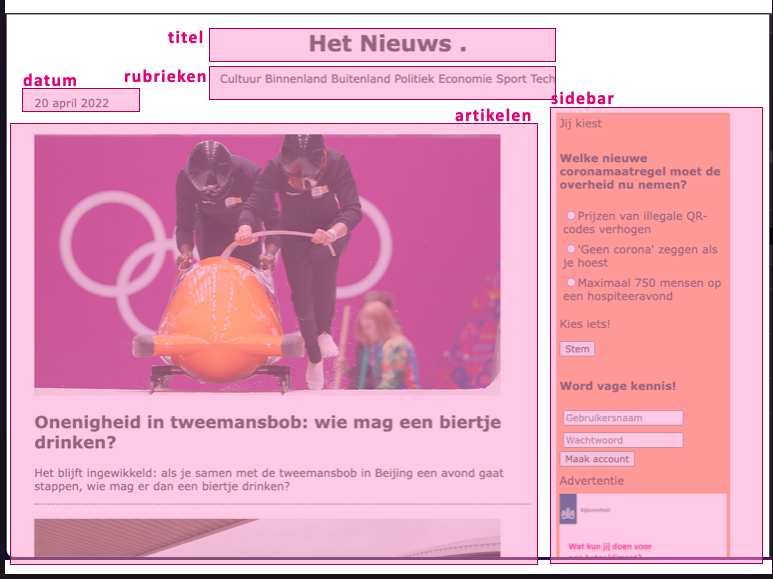
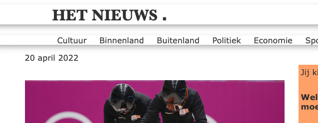
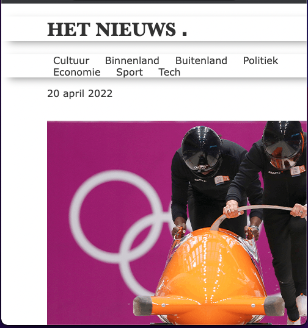
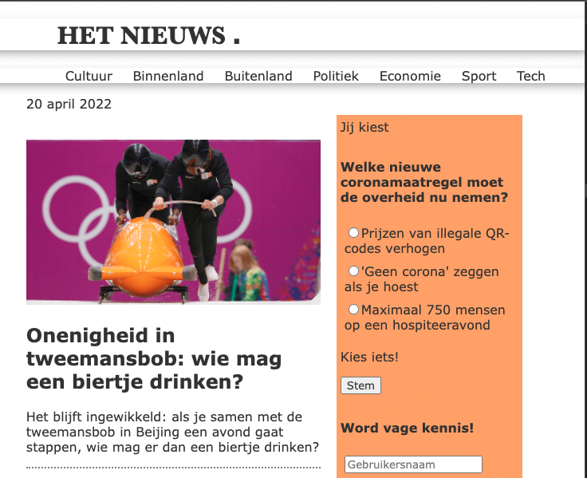
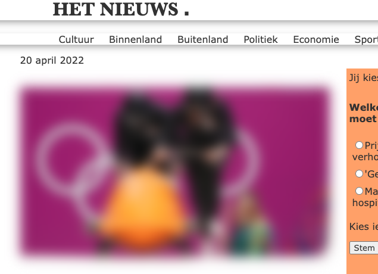
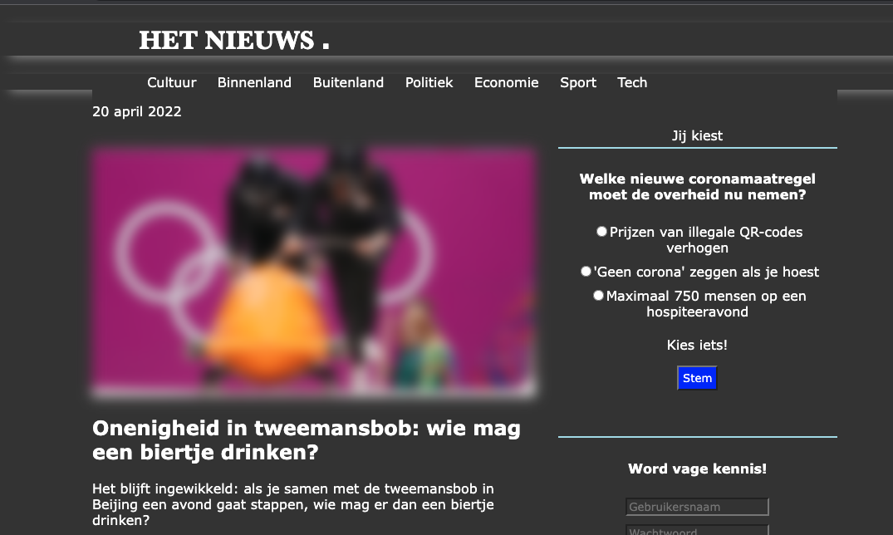
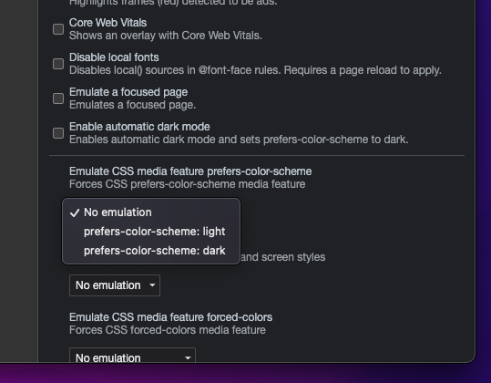

# Practicum week 2 – HTML en CSS (2)

## 1. Test your skills

Tijdens het hoorcollege is uitgebreid stilgestaan bij de positionering van elementen. We beginnen dit practicum met een twee eenvoudige oefeningen [die te vinden zijn op MDN](https://developer.mozilla.org/en-US/docs/Learn/CSS/CSS_layout/Position_skills). 

## 2. De nieuwssite

Deze en volgende week gaan we werken aan een mooie nieuwssite. Volgende week gaan we daar met behulp van JavaScript interactiviteit aan toevoegen; deze week beginnen we met de boel een beetje flexibeler, fraaier en moderner maken.

[Download de zip met de nodige bestanden](files/nieuwssite-wk2.zip), pak hem uit en open `index.html` in een browser. Zoals je ziet is de site momenteel nogal rommelig en onprofessioneel vormgegeven. Bestudeer de `index.css` om je een beeld te vormen van hoe één en ander is aangepakt.

De pagina bestaat uit een aantal onderdelen: de titel met daaronder wat rubrieken (Cultuur, Binnenland, Buitenland, ...). Dan heb je aan de linkerkant de hoofdartikelen (iets met bobsleeën en bezinepompen) en aan de rechterkant wat overige informatie en reclame. Om het spreken hierover wat te vereenvoudigen, hebben we de verschillende onderdelen in het plaatje hieronder even expliciet benoemd.

#### De titel en rubrieken.

De pagina heeft nu niet een heel nieuwswaardige uitstraling: overal is het lettertype hetzelfde en om historische redenen is het gebruikelijk dat nieuws overtuigende overkomt wanneer in ieder geval de titel van de site een schreefletter heeft. Bovendien is het stom dat deze tekst rücktsichlos gecenteerd wordt.

Lijn zowel de titel als de rubrieken links uit. Geef de titel ('Het Nieuws') een schreefletter, bijvoorbeeld een [Garamond](https://en.wikipedia.org/wiki/Garamond) of [Baskerville](https://en.wikipedia.org/wiki/Baskerville). Zorg er daarbij voor dat er altijd kan worden teruggevallen op het systeem-lettertype met schreef. Zet tenslotte, nu je toch bezig bent, door middel van css de titel om in bovenkast (kapitalen, hoofdletters).

Voorzie de verschillende links in de rubrieke van wat meer ruimte, zodat het geheel een wat professionelere uitstraling krijgt.

Zoals je ziet hebben zowel de titel als de rubrieken een klasse `shadow-divider`. Maak van dit gegeven gebruik om deze elementen wat duidelijker voor het voetlicht te brengen; denk hierbij aan de [`gradient`](https://developer.mozilla.org/en-US/docs/Web/CSS/gradient), [`box-shadow`](https://developer.mozilla.org/en-US/docs/Web/CSS/box-shadow) of [`transform`](https://developer.mozilla.org/en-US/docs/Web/CSS/transform) die we tijdens het plenaire deel hebben laten zien.

!!! Info "Box shadow"
    Bekijk ook [deze tool](https://developer.mozilla.org/en-US/docs/Web/CSS/CSS_Backgrounds_and_Borders/Box-shadow_generator) om een fraaie box-shadow te creëren.

#### Flexibele vormgeving

Momenteel is de site niet echt flexibel: de inhoud past zich niet aan aan de grootte van het scherm (de 'viewport') omdat de breedte van de `div`s hard in pixels is gecodeerd. Dit heeft tot gevolg dat gedeelten van de site buiten beeld komen wanneer je de schermgrootte verandert.

Tijdens het plenaire deel hebben we gesproken over [de css-units](https://developer.mozilla.org/en-US/docs/Learn/CSS/Building_blocks/Values_and_units) `vw` en `vh`. Maak van deze properties gebruik zodat de artikelen zo'n tweederde van de schermbreedte gebruiken en de sidebar de resterende eenderde voor z'n rekening neemt. Hou wel in de gaten dat de afbeeldingen bij de artikelen meeschalen. Check je uitwerking door je schermgrootte te vergroten en te verkleinen.

#### Blurring the images

Om de site wat moderner te maken, gaan we de plaatjes bij de nieuwsitems animeren. Maak gebruik van [`filter:blur(10px)`](https://developer.mozilla.org/en-US/docs/Web/CSS/filter) om deze afbeeldingen van scherp naar vaag en weer omgekeerd vorm te geven. Maak een animatie waarbij dit elke vier seconden gebeurt.

!!! Warning "Intensief"
    Let op: je kunt gekke en leuke dingen doen met `blur`, maar hou er rekening mee dat dit behoorlijk processor-intensief is. Zie [deze discussie op StackOverflow](https://stackoverflow.com/q/65538718/10974490). Denk ook aan de experimenten met Lighthouse die we vorige week gedaan hebben. Hou er rekening mee dat site normaliter primair bedoeld is om informatie over te dragen en dat dit soort grappige effecten het best spaarzaam ingezet worden.

#### De sidebar beter maken

Tot nu toe hebben we ons op de artikelen zelf gericht, maar de sidebar behoeft ook enige aandacht. Realiseer de volgende punten:

- de tekst van de elementen in de sidebar is gecenteerd
- de verschillende elementen hebben zo'n 50px afstand tot elkaar
- aan de bovenkant wordt een gekleurd balkje gezet
- knoppen in de sidebar hebben een speciale achtergrond- en letterkleur
- achtergrondkleur van die elementen is lichtgrijs 

Let op: je moet voor alle kleuren die je gebruikt een variabele maken en die gebruiken met behulp van [`var`](https://developer.mozilla.org/en-US/docs/Web/CSS/var).

## 3. Media queries

#### breedte aanpassen

De artikelen en de sidebar blijven nu altijd de beschikbare breedte verdelen. Dit is niet handig wanneer dit erg klein dreigt te worden. Zorg er met behulp van een *Media Query* voor dat de rechterkolom verdwijnt (onder de artikelen wordt gezet) wanneer de breedte van het scherm minder is dan 750px.

#### darkmode toevoegen

Veel mensen [hebben hun computer tegenwoordig standaard op dark mode staan](https://www.searchenginewatch.com/2020/09/30/why-dark-mode-web-designs-are-gaining-popularity/), waarbij de achtergrond donker is en de letters licht. Maak gebruik van een *Media Query* om dit ook voor onze site te realiseren. Je hoeft hierbij niet alle kleuren van een donkere en lichte variante te voorzien: het volstaat dat je de achtergrondkleur van de pagina zelf aanpast en de kleur van de letters, zodat alles nog wel leesbaar blijft.

!!! Info "dark mode"
    Hoewel *dark mode* tegenwoordig behoorlijk populair is, is er weinig wetenschappelijk bewijs te vinden waaruit zou blijken dat dit beter zou zijn voor je ogen. Het kan er wel voor zorgen dat je batterij wat langer meegaat. Zie bijvoorbeeld [dit artikel op visioncenter.com](https://www.visioncenter.org/blog/dark-mode-eye-health/), of [dit stuk op howtogeek.com](https://www.howtogeek.com/423717/dark-mode-isn%E2%80%99t-better-for-you-but-we-love-it-anyway/).

!!! Tip "Testen van darkmode"
    In Google Chrome kun je goed de verschillende renderingen voor dark of light mode testen. Klik in de inspector tools op de drie puntjes naar de console-tab. Hier kun je het tabblad `Rendering` kiezen. In dat tabblad kun je vervolgens het *color-scheme* selecteren.

    

## 4. Flexbox

Tijdens het hoorcollege zijn verschillende waarden van `display` besproken (zie eventueel [nog de documentatie op MDN](https://developer.mozilla.org/en-US/docs/Web/CSS/display)). Voor de opzet van onze website is het gebruik van de `flexbox` eigenlijk het meest voor de hand liggend: dan worden de artikelen vanzelf `flexbox-item`s en kun je er voor zorgen dat deze netjes en direct onder elkaar worden weergegeven.

Pas de css aan, zodat hierbij gebruik gemaakt wordt van de `flexbox`.

