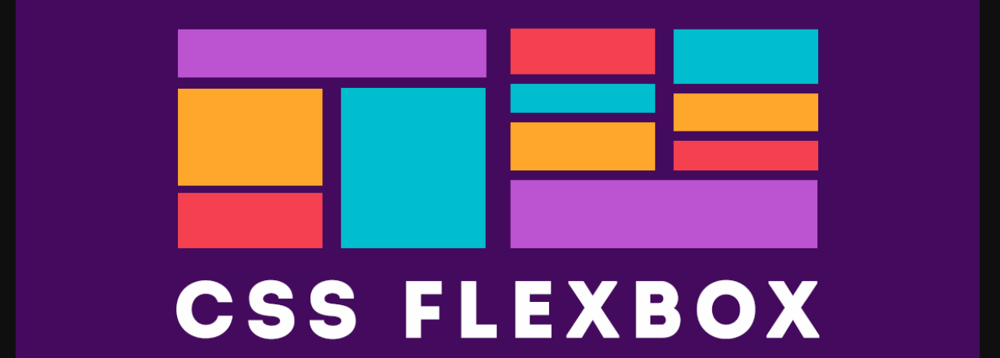

# Week 3: HTML en CSSS 2

Deze week ronden we het materiaal over html en css voor wat betreft dit thema (en de opleiding) af. Deze technieken zijn dusdanig uitgebreid dat ze op zichzelf een heel thema zouden legitimeren (dat ook bestaat), maar voor software engineers is het voldoende een meer dan *hands-on* kennis van te hebben. Specifiek gaan we deze week in op *media queries*, het concept van de *flexbox*, de *shadow DOM* en *user components*. 

## Hoorcollege

Het hoorcollege bespreekt deze onderwerpen op een meer theoretische manier. Er wordt ingegaan op de werking van de *flexbox*, de *shadow DOM* en *user components*, de verschillen met de meer traditionele html/css-elementen en de problemen waar deze technieken een oplossing voor proberen te vormen. We kijken naar specifieke *use cases* die hiermee gepaard kunnen gaan.

Behalve een meer theoretische aanpak, zal ook de praktijk aan bod komen. Aan de hand van *live coding* zullen voorbeelden en uitwerkingen de revue passeren, waarbij de mogelijkheden (en problemen natuurlijk) duidelijk gemaakt worden. Deze praktische aanpak zal zijn weerslag hebben in het hierbij horende practicum.

## Practicum

Ook tijdens het practicum staan de *flexbox*, de *shadow DOM* en *user components* centraal. Elk van deze drie zal aan de hand van een kleine concrete en specifieke opgave worden uitgediept. 

## Literatuur

- [MDN over de flexbox](https://developer.mozilla.org/en-US/docs/Learn/CSS/CSS_layout/Flexbox)
- [MDN over de shadow DOM](https://developer.mozilla.org/en-US/docs/Web/Web_Components/Using_shadow_DOM)
