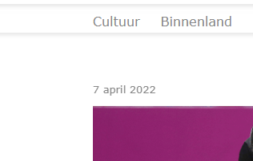
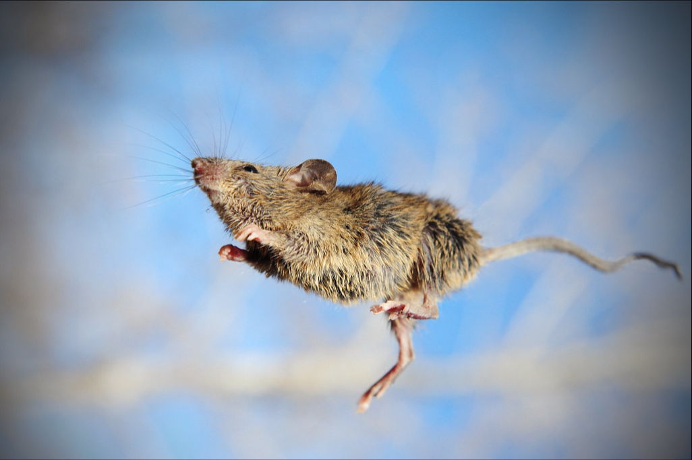
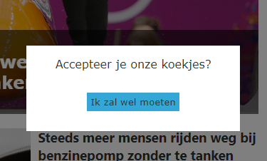
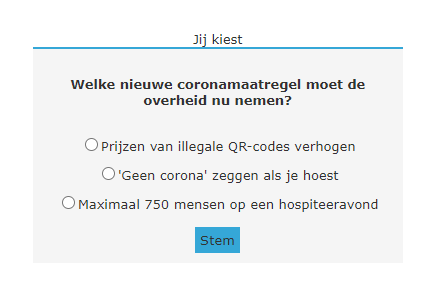
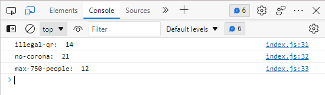
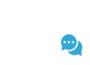

# Week 3 - JavaScript

Deze week gaan we verder met de nieuwssite waar we vorige week ook mee hebben gewerkt. We gaan met JavaScript deze site 'tot leven wekken' in de verschillende oefeningen. Bij elke oefening is het de bedoeling dat je alléén JavaScript schrijft, alle benodigde HTML en CSS is namelijk al gegeven.

[Download deze zip](files/nieuwssite.zip), pak hem uit en open `index.html` in een browser. Je hoeft dit niet per se via een server te doen: omdat alles wat we doen in de browser gebeurt, hoef je geen echte verbinding met een backend te hebben.

---

## 1. Date (15 minuten)
Net boven het featured artikel staat een datum. Deze staat hardcoded in de HTML. Zorg er met het `Date` object voor dat hier altijd de datum van vandaag wordt getoond in hetzelfde format als de datum die er nu hardcoded in staat. Gebruik hiervoor `toLocaleDateString` en geef de juiste opties mee. Gebruik vervolgens `innerHtml` om de datum in het juiste HTML element te tonen.

---

## 2. Timing Events (15 minuten)

#### 2a. Automatisch wisselen tussen featured artikelen
Momenteel is er maar één featured artikel bovenaan de lijst met nieuwsartikelen te zien. Zorg ervoor dat deze elke 7 seconden afwisselt met de andere featured artikelen. De andere staan wel in het HTML document, maar staan momenteel nog op `display: hidden`. Je hebt `getElementsByClassName` nodig om de lijst van featured artikelen te selecteren. Met een `setInterval` kun je vervolgens door deze lijst heen for-loopen. Maak vervolgens bij elke keer dat het interval 'af gaat' één artikel zichtbaar, en verstop de rest.

---

#### 2b. Een irritante pop-up tonen na 10 seconden
In het HTML bestand staat een element met id `subscription-pop-up`. Deze is nu nog niet zichtbaar (`display: none`). Zorg ervoor dat deze 10 seconden na het openen van de pagina zichtbaar wordt met een `setTimeout`. Zodra je de pop-up zichtbaar hebt gemaakt, zorg dan ook dat het scrollen even niet mogelijk is door `overflow` toe te voegen aan de gehele `body`. Voeg ook een `EventListener` toe voor het `click` event van de knop met id `reject-subscription` om te zorgen dat de pop-up weer verdwijnt.

---

## 3. User Events (30 minuten)

#### a. Ondertitel tonen bij hover over featured artikel
Net zoals de 'listed' artikelen, heeft hebben de 'featured' artikelen een ondertitel. Deze staan al in de HTML, maar zijn nog niet zichtbaar. Zorg ervoor dat de ondertitels zichtbaar worden zodra de muis over het artikel zweeft. 

!!! warning "meerdere featured artikelen"
    Let op: aangezien er meerdere featured artikelen zijn, kun je geen id toekennen aan het element waar de ondertitel in staat. Maak daarom gebruik van `getElementsByClassName` en voeg een `EventListener` toe aan alle artikelen dat gebruik maakt van de `mouseover` en `mouseleave` events. Zorg er vervolgens voor dat je op het juiste moment de CSS class `visible` aan de ondertitel toevoegt of juist verwijdert.

 

---

#### b. Een irritante pop-up tonen bij eerste keer scrollen
In het HTML bestand staat een element met id `cookies-pop-up`. Deze is nu nog niet zichtbaar (`display: none`). Zorg ervoor dat deze zichtbaar wordt bij de eerste keer scrollen. Voeg hiervoor een `EventListener` toe voor het `scroll` event aan de gehele pagina. Zodra je de pop-up zichtbaar hebt gemaakt, zorg dan ook dat het scrollen even niet mogelijk is door `overflow` toe te voegen aan de gehele `body`. Voeg ook een `EventListener` toe voor het `click` event van de knop met id `accept-cookies` om te zorgen dat de pop-up weer verdwijnt. Zorg dan ook dat de `EventListener` voor `scroll` verwijderd wordt, zodat je niet oneindig koekjes moet blijven accepteren...

---

## 4. Forms (30 minuten)
De poll over de coronamaatregelen heeft momenteel nog geen functionaliteit, maar met JavaScript kunnen we ervoor zorgen dat je client-side kunt stemmen. Je hoeft geen extra HTML elementen toe te voegen of aanpassingen daarin te doen, de benodigde elementen staan al voor je klaar.

---

#### a. De resultaten client-side opslaan
De tweede stap is het opslaan van de resultaten in de `localStorage`. In het `form` element zie je dat de poll uit drie opties bestaat die elk een uniek id bevatten. Maak gebruik van een `EventListener` dat luistert naar het `submit` event van het `form` element. Tel vervolgens het aantal stemmen per optie en bewaar de resultaten in de `localStorage`. Voor deze stap is het genoeg om de resultaten uit te printen in de console. 

---

#### b. Resultaten laten zien zodra er gestemd is
De volgende stap is het tonen van de resultaten die je al hebt kunnen opslaan in de `localStorage`. Onder het element waar de poll in staat, zie je een element met id `poll-results`. Deze kun je gebruiken om op de juiste plek met `innerHTML` de resultaten toe te voegen nadat er gestemd is. 

---

#### c. Het formulier valideren
Nu ga je valideren of de gebruiker überhaupt een optie heeft aangevinkt, voordat we de resultaten tonen. Zo lang de gebruiker nog niets heeft aangevinkt, maar wel de stemknop gebruikt, mogen de resultaten nog niet worden getoond, en verschijnt er een foutmelding. De foutmelding staat al in het HTML document en heeft als id `form-warning`. 

---

#### d. Teruggaan naar de poll
In de laatste stap zorg je ervoor dat je met de knop "Terug naar poll" de poll weer te zien krijgt in plaats van de resultaten, zodat je opnieuw kunt stemmen (en vals kunt spelen?). Voeg hiervoor een `EventListener` toe aan de knop, en schrijf een functie waarmee je de zichtbaarheid van poll vs resultaten kan toggelen.

---

## 5. Animaties (30 minuten)

#### a. Bewegend chat icoontje
Rechts onderaan de pagina zie je een chat icoontje. Zorg met een `setInterval` dat elke 0,1 seconde de hoogte van het icoon wordt aangepast zodat het icoontje continu groter en dan weer kleiner wordt. Dat betekent dat je in een variabele bijhoudt welke richting het icoon op beweegt om te kunnen bepalen of je een pixel erbij moet optellen of juist aftrekken.

---

#### b. Bij hover over artikel, doorzichtigheid van overige artikelen animeren
Alle 'listed' artikelen hebben dezelfde class, namelijk `listed`. Zorg ervoor met `getElementsByClassName` dat deze artikelen de class `see-through` krijgen die de doorzichtigheid van de artikelen animeert, zodra je over een artikel hovert met de muis. Doe dit alleen niet voor het artikel waarover je hovert. Hierdoor krijgt het geselecteerde artikel de focus. Zodra de muis over geen enkel artikel zweeft, verdwijnen alle animaties. Doe dit met `getElementsByClassName`, `EventListeners` en een aantal for loops.

---
