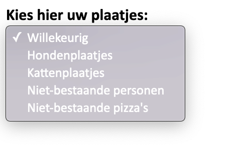

# Week 4 - Memory 2 - tweede formatieve toetsmoment

### Memory 2

Voor dit toetsmoment moeten alle functionele eisen die [in week drie besproken zijn](../week3/memory.md) gerealiseerd zijn.

Toevoeging voor deze week is om afbeeldingen uit externe API's te gebruiken, in plaats van letters uit het alfabet. Denk hierbij bijvoorbeeld aan:

- [Lorem Picsum](https://picsum.photos/)

- [DogAPI](https://dog.ceo/dog-api/)

- [The CATAAS](https://cataas.com/)

Maar andere externe api's zijn natuurlijk ook mogelijk. Voeg een keuze-optie toe waarmee de speler kan kiezen wat voor soort plaatjes hij of zij op de kaartjes wil zien:

Maak gebruik van `Promise` en `fetch` voor het ophalen van de afbeeldingen. 

Zorg er voor dat de *gesloten* kaarten ook de kleur krijgen die de speler met de *color picker* heeft uitgezocht. Ook tijdens het spelen moet je deze kleur kunnen aanpassen.

!!! Warning "Beoordeling"
    Naast de functionaliteit worden ook de leesbaarheid en netheid van je code beoordeeld. Ook blijft accessibility en responsiveness belangrijk. Gebruik geen libraries en frameworks.

    Zorg ervoor dat je code is opgeslagen in verschillende bestanden (dus niet al je JavaScript-code in één bestand); maak gebruik van [*JavaScript Modules](https://developer.mozilla.org/en-US/docs/Web/JavaScript/Guide/Modules)*.

### Leesopgaven

1. Lees hoofdstuk 2.5 van het proefschrift [JavaScript: an analysis of the language and its impact on web development](https://repository.cardiffmet.ac.uk/bitstream/handle/10369/8554/Henson,%20Thomas.pdf?isAllowed=y&sequence=1) door Thomas Henson (of hier [offline](../materialen/week4-jwt/Proefschrift-Henson,Thomas.pdf)). Welke methode wordt er voornamelijk beschreven om een idee te krijgen bij de impact van JavaScript op webpagina's? Voer deze methode zelf ook uit in je browser en bekijk vier van je favoriete websites. Wat valt je op?

2. Lees hoofdstuk 2.7 "Will it still be relevant in the future?" van hetzelfde proefschrift. Beschrijf één van de redenen die de schrijver noemt waardoor er andere talen dan JavaScript worden overwogen voor het web. Denk je dat dit inderdaad een belangrijke reden is om JavaScript te vervangen? Beargumenteer je antwoord.