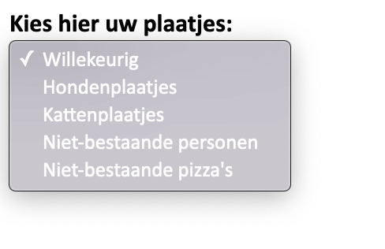

# Memory week 4

De toevoeging voor deze week is om afbeeldingen uit externe API's te gebruiken, in plaats van algemene *placeholders*. Denk hierbij bijvoorbeeld aan:

- [Lorem Picsum](https://picsum.photos/)

- [DogAPI](https://dog.ceo/dog-api/)

- [The CATAAS](https://cataas.com/)

Maar andere externe api's zijn natuurlijk ook mogelijk. Voeg een keuze-optie toe waarmee de speler kan kiezen wat voor soort plaatjes hij of zij op de kaartjes wil zien:

Maak gebruik van `Promise` en `fetch` voor het ophalen van de afbeeldingen. 

### Beoordelingscriteria
- Er kunnen meerdere API's gekozen worden.
- Er wordt gebruik gemaakt van `Promise` en `fetch` en van asynchrone functies

