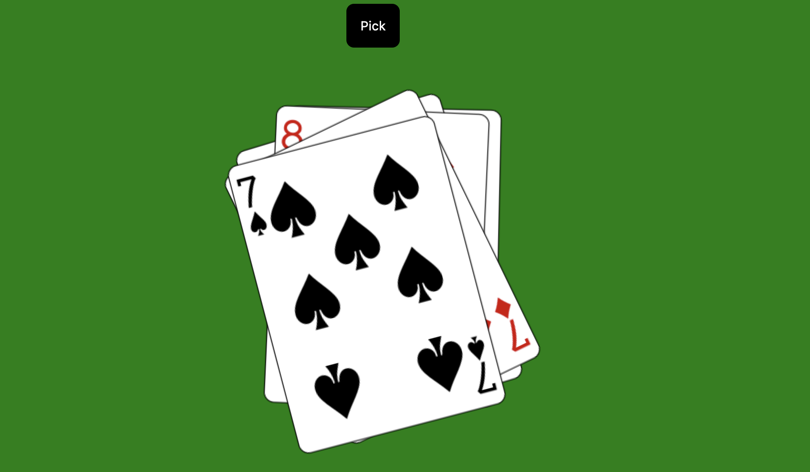
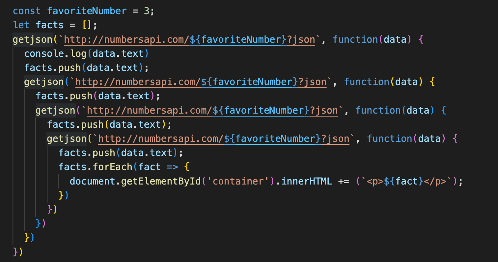

# Practicum week 4

Deze week gaan we werken met `fetch` en met `Promises`. We bouwen daarbij verder op de technieken die we in de vorige weken hebben besproken en waar we mee hebben geoefend. De bestanden voor deze week vind je [in deze zip](files/week4.zip).

## 1: Promises

#### 1a: Omzetten van code in promises.

Run en bestudeer het bestand `cards.html`. Hierin maken we gebruik van weer een API om een spel kaarten sequentieel op te halen. Hoewel deze code op zich nog redelijk overzichtelijk is, is het toch beter om dit om te zetten in een wat hedendaagsere manier van werken. Herschrijf deze code waarbij je gebruik maakt van `Promise`s.

#### 1b: Omzetten van een callback-hell in promises

Run en bekijk het bestand `numbers.html`. Zoals je ziet wordt hier gebruik gemaakt van een externe API om interessante gegevens van een nummer op te halen. Bestudeer met name de werking van de functie `getjson()`.

Deze methode wordt uitgebreid gebruikt in het stukje javascript dat hier onder staat. Je kunt je voorstellen dat dit niet heel handig is, qua broncode. Herschrijf deze code in de vorm van promises. Maak hierbij gebruik van [`Promises.all`](https://developer.mozilla.org/en-US/docs/Web/JavaScript/Reference/Global_Objects/Promise/all).

Pas vervolgens de pagina aan zodat de bezoeker een getal kan invullen waar hij of zij interessante gegevens van te zien wil krijgen (momenteel is dat getal hard gecodeerd in `const favoriteNumber`). Maak ook een dropdown om een keuze te bieden van het aantal gegevens dat er opgehaald worden. Je hoeft je niet druk te maken over mogelijke dubbele gegevens die over het getal worden getoond (maar dat mag natuurlijk wel).

## 2: een spinner

Open het bestand `scroller.html` en bestudeer de werking hiervan. Zoals je ziet maken we gebruik van een `grid-view` om een grid van twee kolommen met plaatjes te laten zien. Op één na zijn al deze plaatjes momenteel een spinner, die duidelijk maakt dat er nog geen plaatje is ingeladen.

Het is de bedoeling om wanneer de DOM is ingeladen de spinners te vervangen door echte plaatjes. Je kunt gebruik maken van de site [https://picsum.photos/](https://picsum.photos/): dit is een site waar je automatisch willekeurige plaatjes vandaan kunt halen. Maak gebruik van `fetch` en promises.

## 3: Oneindige scroll

Zoals je ziet staat de laatste regel plaatjes iets onder de *viewport*. Het is de bedoeling dat er een nieuwe regel met twee willekeurige plaatjes aan de DOM wordt toegevoegd op het moment dat deze laatste regel helemaal in de *viewport* terecht is gekomen. Door dit telkens te doen kunnen we een oneindige scroll maken.

De regel die je moet toevoegen is al voor je voorbereid in de html: we maken hier gebruik van de [`template`-node](https://developer.mozilla.org/en-US/docs/Web/HTML/Element/template). Maak gebruik van de methode [`importNode`](https://developer.mozilla.org/en-US/docs/Web/API/Document/importNode) om deze node te laden op het moment dat de laatste regel helemaal te zien is. Pas van beide plaatjes in deze template de `src` aan en voeg het geheel toe aan de `container`. 

!!! Info "`style` en `computedStyle`"
    In deze opgave moet je de css met behulp van JavaScript aanpassen. Op zich is dat niet heel lastig, maar het kan zinvol zijn je te realiseren dat er een verschil bestaat tussen de `style` en de `computedStyle` van een `node`. Lees eventueel [de documentatie op MDN](https://developer.mozilla.org/en-US/docs/Web/API/Window/getComputedStyle) om een idee te krijgen van de verschillen tussen deze twee.

