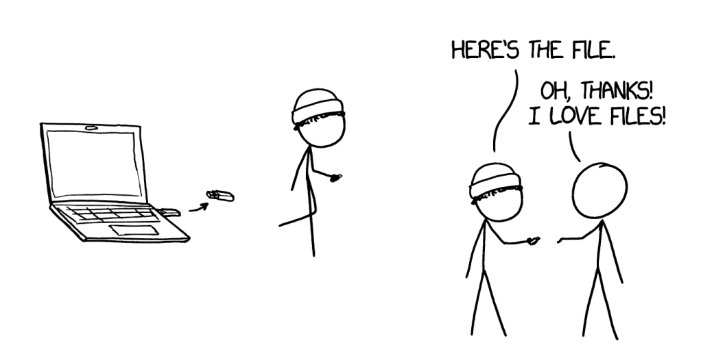

# Week 6: Beveiliging en jwt

Zo gauw een applicatie data van een andere computer haalt dan waarop deze zelf draait, of zo gauw je een applicatie via een netwerk aan andere computers beschkbaar stelt, krijg je te maken met beveiliging: hoe voorkom je dat kwaadwillenden beschikking krijgen over de data of over de code-base zelf. Omdat het web inmiddels volledig als applicatieplatform gezien wordt, zijn deze vragen voor dit thema bijzonder relevant.

Vanzelfsprekend gaan we niet in op alle aspecten van beveiliging: daar is immers een hele eigen opleiding voor. We beperken ons tot de meest voor de hand liggende zaken die elke goede (web)-programmeur zou moeten inzetten om de applicaties op z'n minst een *beetje* te beschermen. Specifiek gaan we in op een techniek die sinds enige jaren hier het meests voor wordt gebruikt: [json web tokens](https://jwt.io/).

## Hoorcollege

Na een korte introductie over beveiliging bespreken we methoden en technieken waarmee webapplicaties veiliger gemaakt kunnen worden. Hierin passeren zaken als `password hashing`, het toevoegen van `salt` en `2FA` de revue. In aansluiting hierop gaan we in op de problemen die met al deze technieken samenhangen en waarvoor `json webtokens` (`JWT`) een oplossing probeert te formeren.

Aansluitend gaan we uitgebreid in op `JWT`. We bespreken de technische voordelen hiervan en laten een concrete implementatie zien. 

## Werkcollege

In het werkcollege gaan studenten zelf aan de slag met kleine concrete praktische opgaven. Er wordt met Javacript connectie gemaakt met een (gegeven) JWT-server, waarna gekeken wordt hoe voorkomen kan worden dat het token te lang niet wordt ververst, of wat er aan te doen valt wanneer dat wel het geval is.

Tijdens dit werkcollege zal ook gekeken worden naar de voor- en nadelen van opslag van het token in een `cookie` of in de `local storage`. Dit biedt als extra'tje de mogelijkheid om te onderzoeken hoe data in de `local storage` kan worden opgeslagen en geadresseerd. Ook bespreken we hoe het token in de http-header van de request kan worden meegestuurd. 

## Literatuur

- [RFC 8725: JWT Best Current Practices](https://www.hjp.at/doc/rfc/rfc8725.html)

- [How hackers hack JWT](https://infosecwriteups.com/hacking-json-web-tokens-jwts-a6eea2753d23)