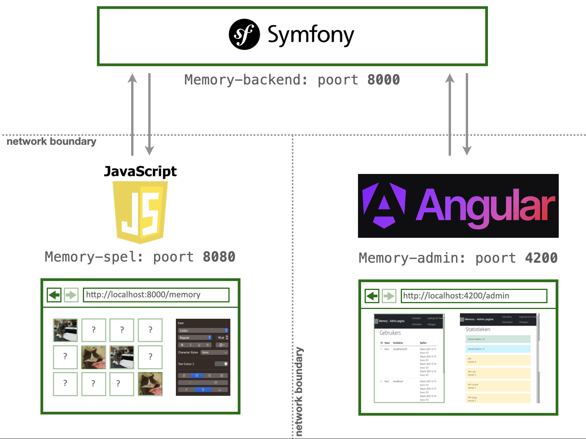

# Memory week 6: Geaggregeerde data

De symfony backend geeft ook geaggregeerde data terug. Het idee hiervan is dat een administrator (`ROLE_ADMIN`) van deze endpoints gebruik kan maken om te zien hoeveel spellen er gespeeld zijn, wie zich heeft aangemeld (voor irritante direct-marketing-doeleinden bijvoorbeeld) en welke API's populair zijn. In deze opdracht moet je de pagina voor de administrator maken. 

Maak gebruik van [Angular](https://angular.dev) om met behulp van [de backend van de memory-game](https://github.com/hanze-hbo-ict/memory-backend) deze geaggregeerde data op te halen en in een fraaie visualisatie te tonen. Bekijk welke geaggregeerde data de backend teruggeeft om een idee te krijgen van de mogelijkheden (en als je een spannende toevoeging ziet, doe vooral een PR). 

!!! Warning "Niet opnieuw bouwen"
    Je hoeft dus niet het hele memory-spel opnieuw in Angular om te bouwen, maar je kunt hier natuurlijk wel een linkje naar de administrator-kant maken. 

Je bent vrij in de uitwerking en layout van de applicatie, dus leef je uit! Er moet *wel* een visualisatie inzitten, dus niet gewoon een row-dump van de data. Je mag zelf de visualisatie bedenken, of gebruik maken van de standaarden die in Angular zitten.

De memory-adminpagina die je in Angular moet bouwen is een andere app dan het memory spel zelf. Hij draait ook op een andere poort (standaard poort 4200). Het hele architectuurplaatje komt er dan als volgt uit te zien:

Aan het eind van het blok lever je *alleen* het memory-spel en de memory-adminpagina (*zonder de `node_modules`-directory) in. Zie verder [de uitgebreide omschrijving bij het toetsmoment](../week7/memory.md).

