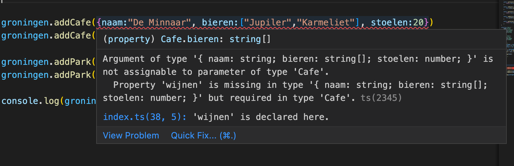

# Practicum week 6

Deze week gaan we aan het werk met [TypeScript]() en [Angular](). We beginnen met wat oefeningen op het gebied van TypeScript, zodat we dat later in kunnen zetten wanneer we een Angular-applicatie gaan opzetten.

## TypeScript

Zoals gezegd is TypeScript een strikte superset van JavaScript. Dat houdt in dat alle valide JavaScript ook valide TypeScript is, maar niet andersom.


## Van TS naar JS
Omdat browsers geen TypeScript aankunnen, moet je je TypeScript-bestanden eerst omzetten naar JavaScript – een techniek die bekend staat als [transpileren](https://learntypescript.dev/11/l3-transpilation). Er zijn verschillende manieren om dat te doen, maar in dit practicum maken we gebruik van `tsc`. Om dit aan de praat te krijgen moet je even wat infrastructuur opzetten:

```shell
# directory waar we gaan werken
mkdir typescript
cd typescript

# initialiseren van npm met alle default-waarden
npm init -y

# installatie van typescript
npm install typescript --save-dev

# instalaltie van tsc
# let op: dat npx is géén typfout
npx tsc --init
```

Vervolgens kun je de opgaven maken in `index.ts` en transpileren met `npx tsc`. Dat genereert een bestand `index.js` wat je vervolgens kun runnen met `node`.

!!! Info "Niet altijd nodig"
    Als we later met Angular gaan werken, wordt dit allemaal automatisch voor je gedaan. Mocht je het voor nu te veel gedoe vinden, kun je ook gebruik maken [van de online editor die Microsoft aanbiedt](https://www.typescriptlang.org/play).

## 1. De stad

We beginnen eenvoudig. Maak een klasse `Stad` die de onderstaande eigenschappen bevat. Zorg ervoor dat beide eigenschappen bij het aanmaken van een object van dit type moeten worden meegegeven. Maak `getters` voor beide eigenschappen.

naam | type | omschrijving
----|----|---
naam | string | naam van de stad
inwoners | number | aantal inwoners

Maak vervolgens de steden Groningen (250.000 inwoners), Winsum (7.500 inwoners) en Delfzijl (24.000 inwoners) aan. Maak gebruik van `map` en `reduce` om op basis van de `getter` van het inwoneraantal van alle drie de steden het *totaal* aantal inwoners van deze drie steden uit te printen. Transpileer je code en bestudeer het gegenereerde JavaScript-bestand. Run tenslotte dit bestand. Als het goed is komt er 281.500 uit.

## 2. Interfaces

Eén van de ideeën achter TypeScript is dat deze taal types toevoegt aan JavaScript. In deze opgave gaan we de klasse `Stad` uitbreiden met twee zelfgemaakte typen: `Park` en `Cafe`. Elke goede stad heeft een aantal parken en een aantal café's. Een park heeft een naam, een grootte en een aantal banken dat je in het park kunt vinden. Een café heeft een naam, een aantal tafels en een lijst van bieren die je in dat café kunt bestellen.

Definieer de beide interfaces `Park` en `Cafe`, overeenkomstig de omschrijving die hierboven gegeven is. Voeg vervolgens een attribuut `parken` en `cafés` (eventueel zonder accent aigue) toe aan de klasse `Stad`: aangezien steden meerdere parken en kroegen kunnen hebben, moet dit natuurlijk een *lijst* zijn. Voorzie daarom deze klasse van een methode `addCafe(c:Cafe)` en van een methode `addPark(p:Park)`. Maak ook `getters` voor beide attributen. Je kunt onderstaande code gebruiken om je uitwerking te testen.

```TypeScript
groningen.addCafe({naam:"De Minnaar", bieren:["Jupiler","Karmeliet"], stoelen:20})
groningen.addCafe({naam:"De Bres", bieren:["Dommelsch","Heineken"],stoelen:13})

groningen.addPark({naam:"Noorderplantsoen", grootte:120, banken:20})
groningen.addPark({naam:"Stadspark", grootte:350, banken:10})

console.log(groningen.getCafes())
```

!!! Info "Creatio ex nihilo"
    Zoals vorige week uitgebreid is toegelicht, kent JavaScript (en dus bij extensie ook TypeScript) zogenaamde *Creatio ex nihilo*: je ziet dat we in de testcode hierboven geen klasse hebben die die interface implementeert, maar dat we eenvoudig objecten maken en die *casten* naar die interface. Dit kan natuurlijk misgaan wanneer we de interface aan zouden passen, maar het fijne van de *type safety* die TypeScript introduceert is dat onze IDE hierover zou vallen. Probeer het maar eens, door bijvoorbeeld `wijnen` toe te voegen aan de `Cafe`-interface...




## 3. Modules

Waarschijnlijk heb je tot nu toe alle bovenstaande uitwerkingen in één bestand (`index.ts`) staan. Eén van de problemen die JavaScript heeft ([of *had*, eigenlijk](https://developer.mozilla.org/en-US/docs/Web/JavaScript/Guide/Modules)) is dat het lastig is om code in verschillende bestanden met elkaar samen te laten werken. Je kunt natuurlijk in je html-bestand verschillende `script`-tags achter elkaar zetten (zoals je weet zijn die *blocking*), maar dat is niet echt praktisch. Om die reden heeft TypeScript het concept van [*modules*](https://www.typescriptlang.org/docs/handbook/modules.html) toegevoegd.

Hernoem je bestand `index.ts` (of hoe je hem maar had genoemd) naar `Stad.ts`. Deze module moet zowel de klasse `Stad` als de bijhorende interfaces exporteren: voorzie ze daarvoor van het sleutelwoord [`export`](https://www.typescriptlang.org/docs/handbook/modules.html#export).

Maak vervolgens een nieuw bestand `index.ts` aan, waarin je de klasse `Stad` uit het bestand dat je zojuist hebt gemaakt importeert. Verplaats vervolgens de code die je in de vorige twee opgaven hebt gemaakt naar dit nieuwe index-bestand. Transpileer de boel en bestudeer het gegenereerde JavaScript-bestand. Als het goed is, kun je nu opnieuw de `index.js` runnen en krijg je hetzelfde resultaat.

```shell
> node index.js
[
  {
    naam: 'De Minnaar',
    bieren: [ 'Jupiler', 'Karmeliet' ],
    stoelen: 20
  },
  { 
    naam: 'De Bres', 
    bieren: [ 'Dommelsch', 'Heineken' ], 
    stoelen: 13 
  }
]
```

Maak nu een nieuwe module waarin je de klasse `Provincie` definieert. Een provincie heeft een lijst van steden, een hoofdstad en een positie in het land. Maak voor dat laatste attribuut gebruik van het onderstaande `enum`. 

```TypeScript
enum Positie {
    Noord,
    Zuid,
    Oost,
    West
}
```

Zorg ervoor dat je bij het aanmaken van een object van het type `Provincie` de *naam* en de *positie* mee moet gegven. Voorzie deze klasse verder van een methode `getInwoners()`, waarin je het totaal van de inwoners van alle steden retourneert, en van een methode `addSteden`, waaraan je een *willekeurig aantal* steden kunt meegeven die vervolgens aan de lijst van steden wordt toegevoegd.

!!! Warning "Let op"
    Bij deze laatste opgave is het de bedoeling dat je gebruik maakt van de [spread-operator](https://developer.mozilla.org/en-US/docs/Web/JavaScript/Reference/Operators/Spread_syntax)

Je kunt de onderstaande code gebruiken om je uitwerking te testen, en ook om een beeld te krijgen van wat de bedoeling is.

```TypeScript
const grunn:Provincie = new Provincie("Grunn", Positie.Noord);
grunn.addSteden(groningen, winsum, delfzijl)
console.log(`Onze fraaie provincie heeft ${grunn.getInwoners()} inwoners`)
```

## 4. Angular

Na deze relatief eenvoudige oefeningen gaan we verder met het werken met Angular. Hiervoor maken we gebruik van [getting started with Angular](https://angular.dev/tutorials/learn-angular).
