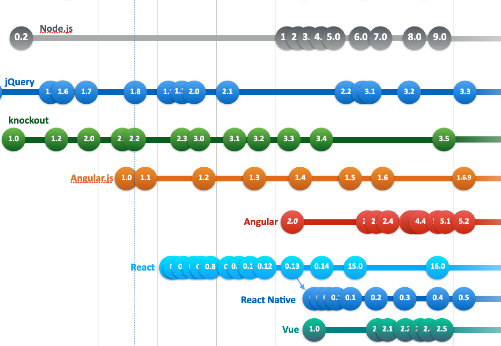

# Week 7: MVC en Frameworks 2

Deze laatste week gaan we verder met MVC en frameworks. Waar we vorige week geëindigd zijn met de problemen te identificeren en concrete kleine oplossingen daarvoor aan te bieden, gaan we deze week in op bestaande industrie-standaarden die het afgelopen decennium binnen deze problematiek ontwikkeld zijn.

## Hoorcollege

In het hoorcollege gaan we in op de drie grote spelers op dit gebeid: Vue, Angular en React. We bespreken de verschillen en overeenkomsten tussen deze drie frameworks, gaan in op specifieke *use cases* en geven van alledrie een korte introductie. De focus ligt hierbij op de manier waarop deze frameworks de geïdentificeerde problemen adresseren.

Verder geven we een korte introductie op [TypeScript](https://www.typescriptlang.org/), de *de facto* industriestandaard voor het ontwikkelen van grote complexe online applicaties. Hierbij laten we zien hoe dit verschilt en overeenkomt met JavaScript en welke gevolgen deze taal heeft voor het ontwikkelproces.

## Practicum

In het practicum gaan we een eenvoudige applicatie in Angular uitprogrammeren. Hierbij ligt de nadruk gebruikersinteractie, de modularisatie-aanpak van Angular en op het ophalen en weergeven van data. 

## Literatuur

[A Comparative Analysis of Web Frameworks (Angular JS, React JS, Vue JS)](http://solidstatetechnology.us/index.php/JSST/article/view/10448)

