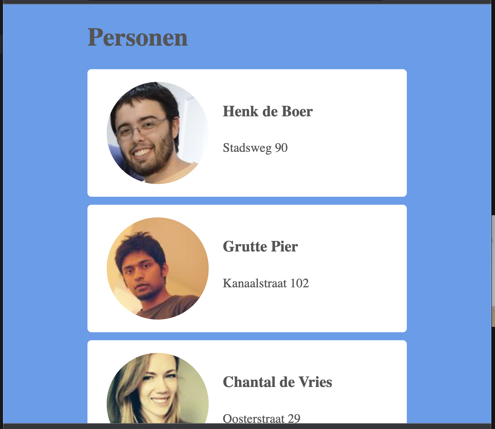
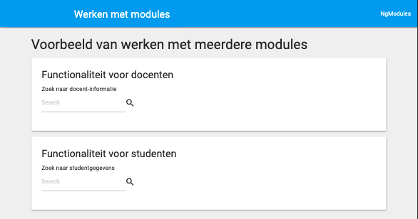
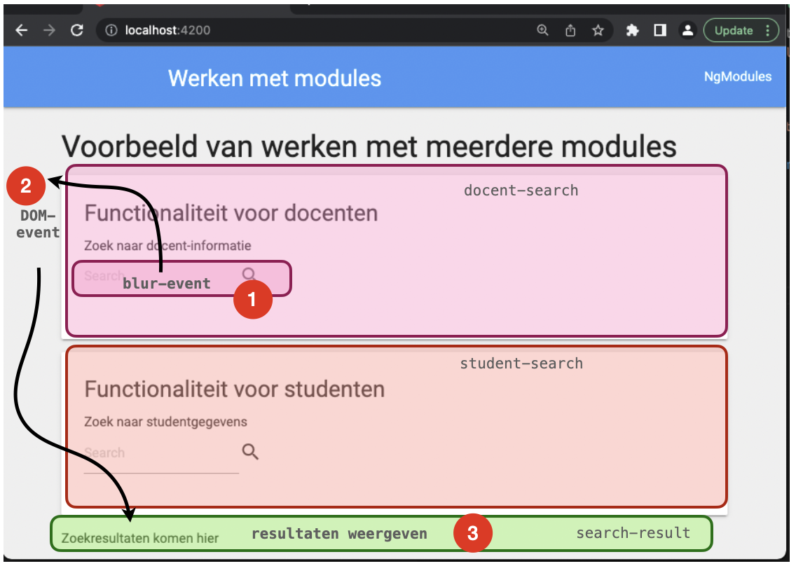
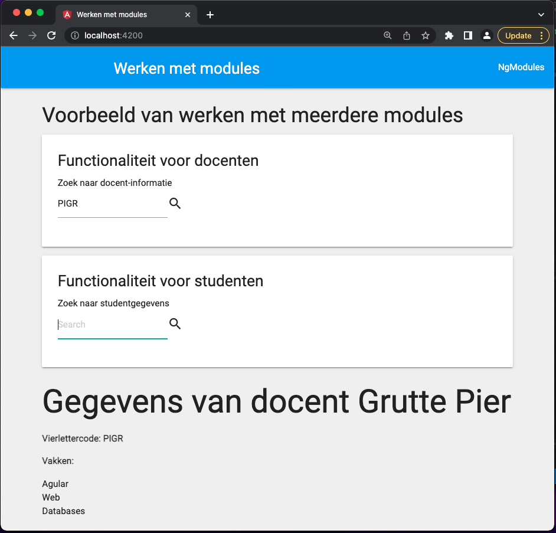
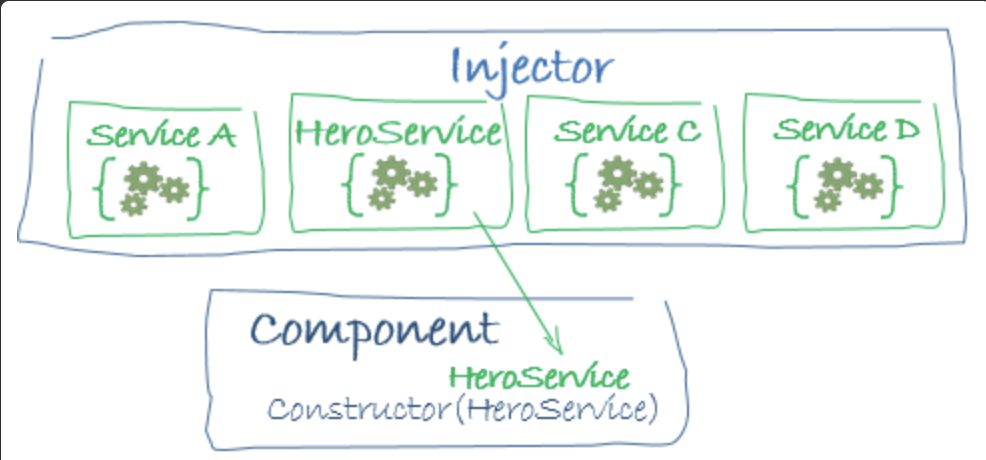

# Practicum week 7

## Inleiding

Deze week gaan we verder met Angular. We zullen verschillende manier onderzoeken waarop componenten met elkaar kunnen communiceren en hoe je connectie maakt met de backend. Voordat we dat gaan doen, zullen we wat dieper ingaan op webcomponents, omdat dit een centrale techniek is in Angular en vergelijkbare frameworks. De code die je voor deze week nodig hebt vind je [in deze zip](files/week7.zip). Hierin vind je drie directories: `Angular`, `Backend` en `Webcomponents`. 

## 1. Webcomponents

Tijdens het plenaire deel is geïllustreerd hoe je door middel van webcomponents en de *shadow DOM* zelf html-elementen kunt maken. In deze opdracht gebruiken we die kennis en techniek om een lijstje met persoonsgegevens aanzienlijk te vereenvoudigen.

Bekijk de bestanden in de directory `Webcomponents`. Je ziet dat het best index-bestand behoorlijk veel duplicate code bevat, wat we de boel onoverzichtelijk en ononderhoudbaar maakt. Als je goed oplet, zie je dat het onderstaande deel telkens herhaald wordt:

```html
  <div class="card">
    <div class="image">
      
    </div>
    <div class="content">
      <h4> Henk de Boer </h4>
      <p> Stadsweg 90 </p>
    </div>
  </div>
```



!!! Info "Plaatjes"
    Voor het geval je het afvraagt, die plaatjes komen van [randomuser.me](https://randomuser.me/). Misschien ook nog een aardige API om toe te voegen aan het memory-spel...?

Een dergelijk veel-herhalend stukje code vraag er gewoon om om gecompartamentaliseerd te worden, en webcomponents zijn daar de tool voor. Bekijk de code in `person-card.js`. Hierin zit al een stukje css en wat andere steigercode, waarin je als het goed is de html van het voorbeeld hierboven herkent.


#### 1a. het webcomponent maken

Maak een klasse `PersonCard` die overerft van `HTMLElement`. Voorzie de klasse van een property `static get observerAttributes` die een lijstje bevat van `image`, `name` en `address`. Dit worden de attributen die we later aan onze webcomponent mee kunnen geven.

Zorg voor een constructor waarin je de template die bovenin het bestand gegeven is toevoegt aan `this._shadowRoot`. Voorzie vervolgens de klassse van drie properties die corresponderen met de `img`, de `h4` en de `p` in de template. Hier gaan we zometeen de waarden aan toekennen die we bij het maken van een `<person-card>` meegeven.

Maak tenslotte de methode `attributeChanged(name, oldValue, newValue)`. In de `name`-parameter zit één van de geobserveerde attributen die je hierboven hebt aangegeven. De `oldValue` en `newValue` spreken voor zich. In deze methode moet de (nieuwe) waarde van een attribuut toegekend worden aan het corresponderende *property* die je hierboven (in de constructor) hebt gemaakt. Let op: voor de naam en het adres volstaat het om de `innerHTML` aan te passen, maar voor de avatar moet je natuurlijk de `src` wijzigen.

#### 1b. het webcomponent gebruiken

Nu we het webcomponent hebben gemaakt en gedefineerd, kunnen we al die duplicate en relatief complexe html vervangen door een stuk eenvoudiger ogende code – wat er beter uitziet en een stuk onderhoudbaarder is. Gebruik de drie attributen die je in 1a hebt gemaakt om de waarden van de verschillende personen aan de `<person-card>` mee te geven. Als het goed is, is het resultaat hetzelfde (voor het oog althans: de kwaliteit van onze code-base is significant verbeterd).


## 2. Angular

Vorige week hebben we via wat eenvoudige oefeningen kennis gemaakt met TypeScript en met Angular. We hebben gezien hoe je met behulp van de `@Input()` en de `@Output()` annotaties data tussen verschillende componenten kunt versturen en ontvangen. Deze week gaan we dieper in op componenten en data. We kijken hierbij hoe je gebruik kunt maken van DOM-events of van Services om data tussen componenten te delen.

Zorg ervoor dat je Angular (inclusief de CLI) op je lokale machine hebt draaien. Maak gebruik van `ng new week7` om een nieuw project op te starten. Dit commando maakt een nieuwe directory (`week7`) voor je aan. Vervang de bestanden in de `src`-directory door de directory `Angular/src/` die je vindt in [de bestanden van deze week](files/week7.zip).


#### 2a. Native events

Deze opgave gaan we werken met [modules](https://angular.io/guide/architecture-modules). Een module kun je zien als een container waarin stukken code worden geplaatst die samen verantwoordelijk zijn voor een bepaalde functionaliteit. Dit kunnen componenten zijn, maar ook services, constanten, of andere stukken programmacode. Alle onderdelen binnen dezelfde module hebben dezelfde scope (namelijk de module en op die manier fungeert een module dan ook als een *sandbox*.

Het grootste deel van de infrastructuur is al voor je opgezet. Zoals je ziet zijn er in de directory `app/cards` twee componenten: `docent-search` en `student-search`. Deze twee bestanden vormen een soort kaartje waarvan de bezoeker van de site gebruik kan maken om gegevens van docenten en van (drum roll) studenten op te vragen. Bestudeer de code om je een beeld te vormen van hoe één en ander werkt.



Vorig week hebben we gezien dat je data van de ene naar de andere component kon verzenden door gebruik te maken van `@Output()` en `@Input()`. Op zich werkt dit prima, alleen is het probleem dat [deze events niet bubbelen](https://github.com/angular/angular/issues/2296): als ze eenmaal door een component zijn afgevangen, houdt het doorsturen van dit Event ook op. Nu zou je natuurlijk dat proces weer kunnen herhalen, maar het is beter om gebruik te maken van native DOM-events, want [die bubbelen wèl standaard](https://www.w3.org/TR/DOM-Level-2-Events/events.html#Events-flow-bubbling).

In deze opgave gaan we de zoekterm die de bezoeker intypt doorsturen naar de `results`-component. Als je kijkt naar `app.component.ts` zie je dat dit een *sibling* is van de beide zoekkaartjes. De uitdaging is dus om de zoekterm en het zoektype (student of docent) naar deze sibling te krijgen. Zie onderstaande afbeelding door de flow:



Voeg aan de zoekkaart (`app/shared/search-box.component.ts`) een methode `handleEvent()` toe die luistert naar een `blur`-event op het input-veld en een `click` event op het loepje. Deze methode moet [een custom DomElement uitsturen](https://developer.mozilla.org/en-US/docs/Web/API/CustomEvent/CustomEvent) met als naam `newdata`. Dit event stuurt de string uit het inputveld en het type waarop wordt gezocht door: deze combinatie is weergegeven in de interface `searchdata`. Maak hierbij gebruik van het *property* `ElementRef` dat je in de constructor geïnjecteerd ziet worden. Het veld `searchItem` dat je hier zit staan, wordt door de betreffende zoekkaartje geïnitialiseerd (met 'docent' of 'student') Merk op dat het input-element van het formulier voorzien is van de identifier `#searchbox`. 

#### 2b. Afvangen 

Omdat dit event helemaal doorloopt tot de bovenste component (`app.component`) kunnen we het daar ook opvangen. Zoals je kunt zien maken we daar al gebruik van de module `search-result` om de gevonden resultaten onderop de pagina weer te geven. Het is de bedoeling van deze opdracht om het event dat door de search-box wordt verstuurt wordt opgevangen door de `app-component` die het vervolgens doorstuurt aan de `search-result`-component.

Wanneer het customevent wordt uitgestuurd, moet deze `app-component` daarop reageren. Zorg er dus voor (in de html) dat dit event wordt afgevangen en dat er een methode in die component daarop reageert (maak gebruik van de `(event)="handler()`-syntax). Deze methode moet het veld `searchdata` zetten naar datgene wat er door het event wordt doorgestuurd.


#### 2c. Doorsturen

Nu we het veld `searchdata` van de `app.component` aanpassen op het moment dat er een customevent wordt doorgestuurd, kunnen we dit veld gebruiken om de corresponderende waarde in de `search-result`-component te zetten. Maak gebruik van de `[attribute]="value"`-syntax om dit te bewerkstelligen.

Implementeer vervolgens (en tenslotte) de methode `ngOnChanges` in de `search-result`-component. Deze component heeft al beschikkig over de student- en docentdata, dus het enige wat hier moet doen is checken of er gezocht wordt op een student of een docent en vervolgende de betreffende array filteren op respectievelijk het studentnummer of de vierlettercode. Bekijk de data in `data.ts` om te zien hier deze arrays eruit zien.

Geeft het veld `docentdata` of `studentdata` de waarde van het gevonden resultaat (en de andere array op `undefined`) en zoek een student of docent. Als het goed is, krijg je nu de resultaten van je zoekopdracht te zien.




## 3. Services

Hoewel dit werken met events op zich wel werkt, is het (zoals je merkt) behoorlijk omslachtig en foutgevoelig. Om het werken met data makkelijker te maken, wordt in de regel gebruik gemaakt van [services](https://angular.io/guide/architecture-services) – een techniek die we in web 2 ook al zijn tegengekomen. Een service kun je *injecteren* in de componenten die er gebruik van moeten maken (ze worden dan ook voorzien van de annotatie `@Injectable`).



#### 3a. maken van een service
Maak met de angular CLI een service `data`. Bestudeer de code die voor je gegenereert wordt:

```shell
% ng generate service data
CREATE src/app/data.service.spec.ts (347 bytes)
CREATE src/app/data.service.ts (133 bytes)
% 
```

!!! Info "spec.ts"
    Dat tweede bestand `spec.ts` is het bestand dat je kunt gebruiken voor het *testen* van de gegenereerde service. Je kunt die eventueel wel weer weghalen, want testen doen we natuurlijk niet.

Feitelijk doet deze service hetzelfde als wat je net in opdracht 1c hebt gedaan: het bevragen van de data op basis van een `searchdata`-object en dat opslaan in de corresponderende velden (`docentdata` of `studentdata`). Je kunt dus grote delen van deze code kopiëren in een methode `getData(what:searchdata)` die je in deze service moet maken.

#### 3b. publish-subscribe

Zoals tijdens de theorieles is besproken, kun je werken met services zien als een vorm van publish-subscribe. Dat betekent dat je de service moet voorzien van een attribuut waar andere componenten zich op kunne abonneren. In het geval van Angular wordt hierbij gebruik gemaakt van [RxJS BehaviorSubject](https://www.learnrxjs.io/learn-rxjs/subjects/behaviorsubject). Je kunt deze properties gebruiken om wijzigingen in een andere property te versturen.  Bekijk onderstaande (pseudo-)code om hier een beeld bij te krijgen.

```TypeScript
@Injectable()
class Publisher {
    // maak property om waarden in op te slaan
    name:String = ''

    // maak property waar anderen naar kunnen luisteren
    public name$ = new BehaviorSubject<String>(this.name)

    newName(value:String:void {
        this.name = value

        // verstuur een bericht aan de subscribers
        this.name$.next()
    }
}

class Subscriber {
    constructor (private publisher:Publisher) { }

    ngOnInit () {
        // luister naar wijzigingen in publisher.name$
        this.publisher.name$.subscribe ( data => console.log(data) )
    }
}
```

Gebruik deze techniek om de data van studenten en docenten via de service beschikbaar te maken aan de `result`-component (dat wordt in dit verhaal dus de *subscriber*).


#### 3c. weergeven van de data

Injecteer vervolgens de service in de `search`-component en zorg ervoor dat de methode `handleEvent` nu geen gebruik meer maakt van een customevent, maar juist van de method `getData()` in de service. Als je het goed hebt gedaan, zie je nu opnieuw de resultaten van de zoekopdracht in het veld onderaan de pagina verschijnen.

#### 3d. online data

Natuurlijk is het meestal niet zo dat de data die getoond moet worden op de frontend zelf beschikbaar is. Normaliter maak je gebruik van een backend, waar een database achter zit. In deze laatste opdracht gaan we deze stap zetten.

In [de bestanden van deze week](files/week7.zip) zit ook een directory `Backend`, waarin een heel eenvoudig php-script dezelfde data beschikbaar stelt als die in het bestand `data.ts`. Start in deze directory een php-server op (`php -S localhost:8080`) en vervang de code in de dataservice door een `fetch` naar deze backend. Het endpoint `data.php?what=docent` geeft je de docentdata terug en het endpoint `data.php?what=student` de studentdata.

Maak gebruik van je kennis van `Promises` om de boel weer aan de praat te krijgen.


