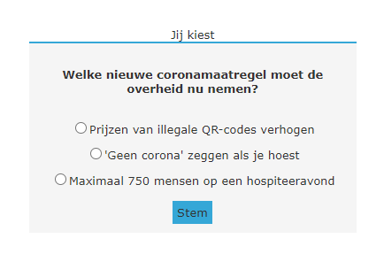

# Week 3 - JavaScript
Gegeven is een nieuwssite dat voor nu alleen bestaat uit HTML en CSS. We gaan met JavaScript deze site 'tot leven wekken' in de verschillende oefeningen. Bij elke oefening is het de bedoeling dat je alléén JavaScript schrijft, alle benodigde HTML en CSS is namelijk al gegeven.

## 1. Date

## 2. User Events

#### a. Ondertitel tonen bij hover over featured artikel
Net zoals de 'listed' artikelen, heeft het 'featured' artikel een ondertitel. Deze staat al in de HTML, maar is nog niet zichtbaar. Zorg ervoor dat de ondertitel zichtbaar wordt zodra de muis over het artikel zweeft.

 

## 3. Timing Events

#### a. Automatisch wisselen tussen featured artikelen
Momenteel staat er maar één featured artikel bovenaan de lijst met nieuwsartikelen. Zorg ervoor dat deze elke 10 seconden afwisselt met een ander featured artikel. De gegevens van de artikelen (titel, afbeelding, ondertitel) zouden in een 'echte' nieuwssite natuurlijk van een server komen, maar deze mogen voor deze oefening hardcoded in het JavaScript bestand staan. 

#### b. Een irritante pop-up tonen x aantal seconden na openen pagina

## 4. Forms

### De poll interactief maken
De poll heeft momenteel nog geen functionaliteit, maar met JavaScript kunnen we ervoor zorgen dat je client-side kunt stemmen. Je hoeft geen extra HTML elementen toe te voegen of aanpassingen daarin te doen, de benodigde elementen staan al voor je klaar.

#### a. De resultaten opslaan in de localStorage
De eerste stap is het opslaan van de resultaten. In het form element zie je dat de poll uit drie opties bestaat die elk een uniek id bevatten. Zorg er met JavaScript voor dat je de stemmen telt per optie en deze opslaat in de localStorage. Voor deze stap is het genoeg om de resultaten uit te printen in de console. 

#### b. Resultaten laten zien zodra er gestemd is
De volgende stap is het tonen van de resultaten die je al hebt kunnen opslaan in de localStorage. Onder het element waar de poll in staat, zie je een element met id `poll-results`. Deze kun je gebruiken om op de juiste plek met JavaScript de resultaten toe te voegen zodra er gestemd is. 

#### c. Teruggaan naar de poll
In de laatste stap zorg je ervoor dat je met de knop "teruggaan naar de poll" de poll weer te zien krijgt in plaats van de resultaten, zodat je opnieuw kunt stemmen (en vals kunt spelen?). 

